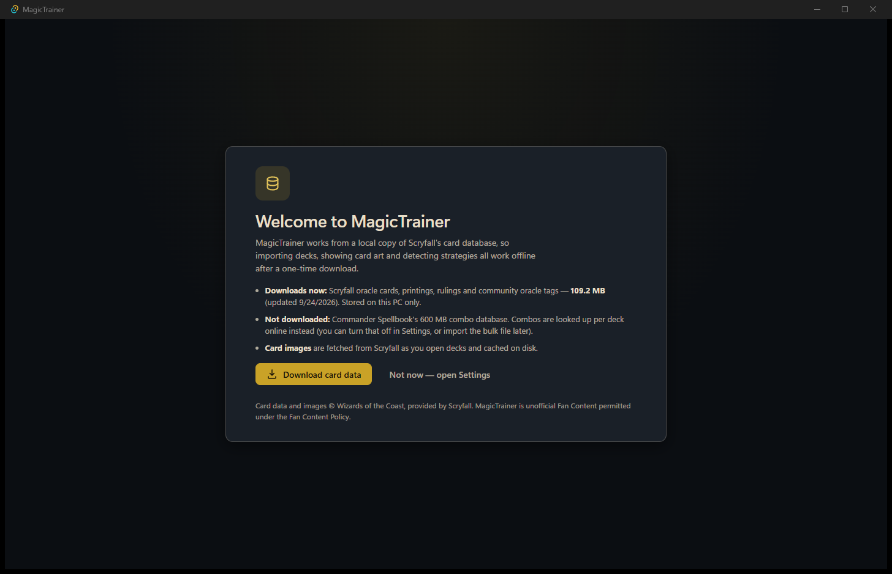
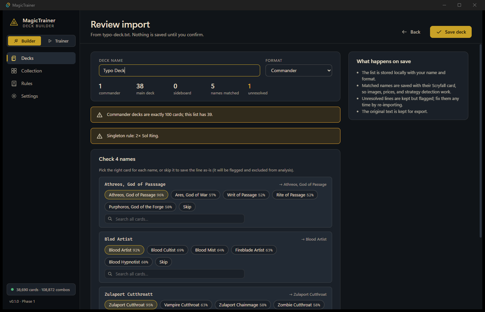
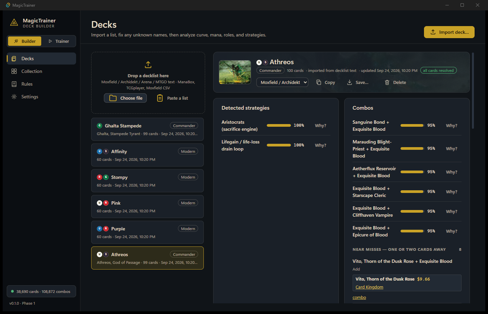
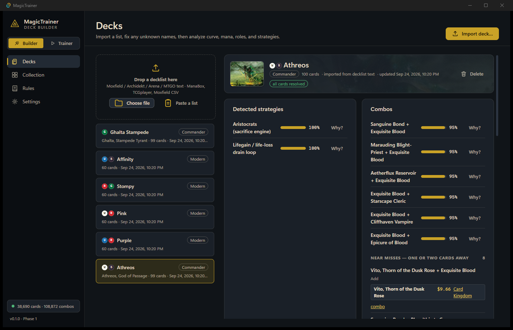
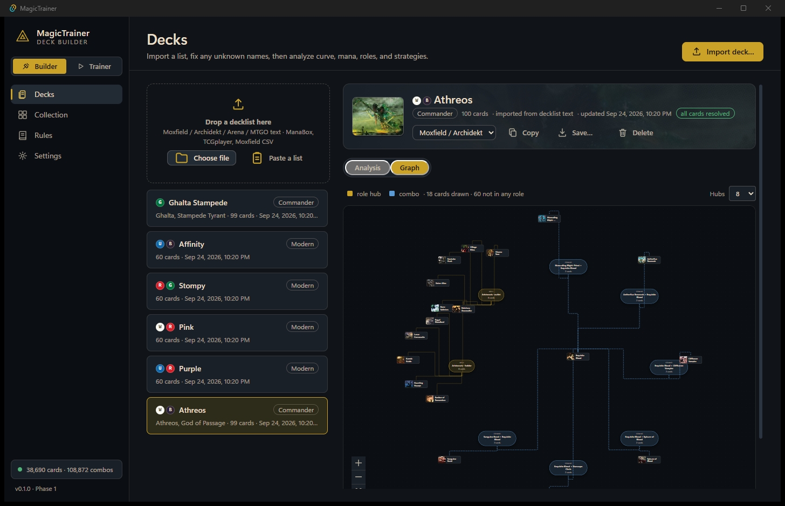
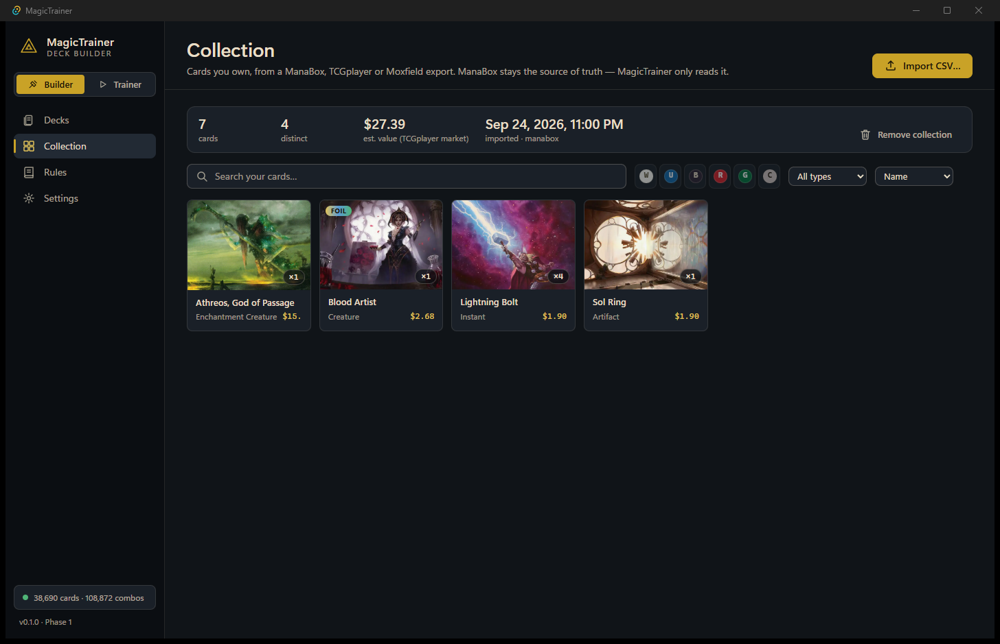
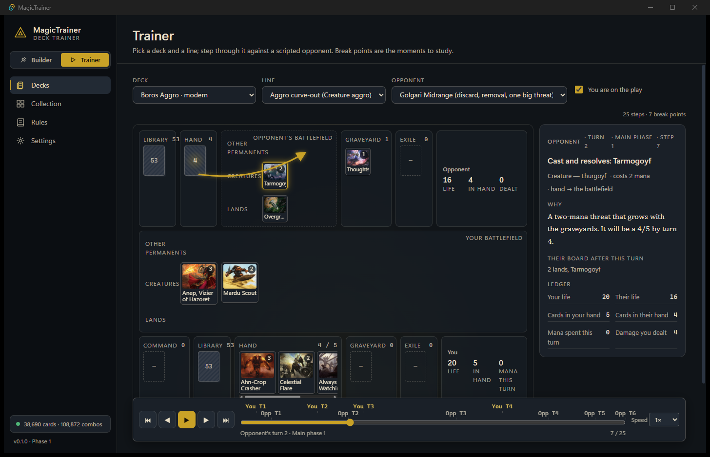
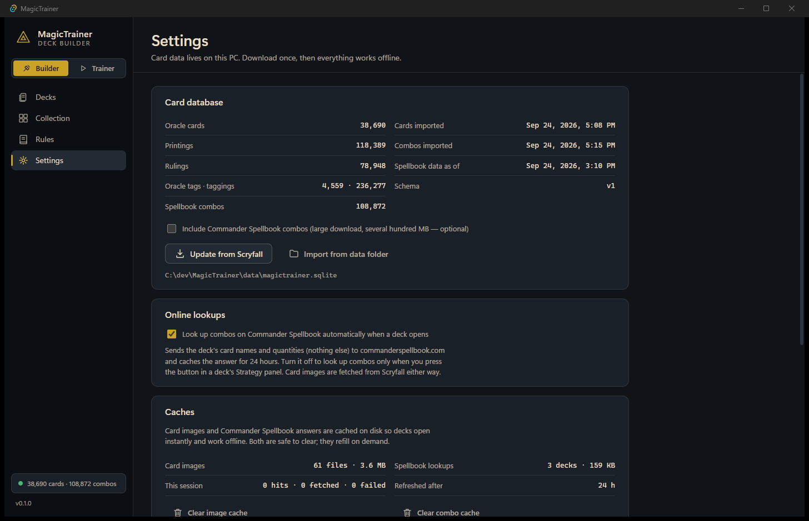

# MagicTrainer

A Windows desktop app for Magic: The Gathering players that imports your decks and collection, detects the strategies and combos inside them, and animates how a deck wins as card trajectories across a game board against scripted opponents.

Owner: William Fischer (Goob Entertainment Co.). Built with Tauri 2, React 19, TypeScript and Rust. Unofficial Fan Content permitted under the Wizards of the Coast Fan Content Policy; card data and images by [Scryfall](https://scryfall.com), combos by [Commander Spellbook](https://commanderspellbook.com).

## What it does

**Deck Builder**

- Import decklists (Moxfield, Archidekt, MTG Arena, MTGO text, or paste) and collections (ManaBox, TCGplayer, Moxfield CSV). Unknown names get a fixer with ranked candidates before anything is saved.
- Deck view: commander art, mana curve, color pips vs. sources, role coverage against the Commander skeleton, format legality.
- Strategy panel: 14 archetype and engine patterns with an inspectable rationale, live Commander Spellbook combos, and near-misses with price and a Card Kingdom link. Cards you already own float first.
- Deck graph: cards as nodes, strategy roles as hubs, combo clusters.
- Export in Moxfield, Arena, and MTGO dialects.

**Deck Trainer**

- Pick a deck, a detected line, and a scripted opponent (seven tracks: mono-red aggro, UW control, Golgari midrange, storm, Commander precon value, stax, graveyard hate).
- Watch the line as arrows between seven zones per side, with a life / hand / mana ledger, a turn-tick scrubber, autoplay, and a step panel whose "why" cites the Comprehensive Rules and whose break points name the interaction that stops the line.

Everything works offline after a one-time 110 MB Scryfall download. Combo lookups send only card names and quantities to Commander Spellbook, and can be switched off.

## Screenshots

| | |
|---|---|
|  First run |  Import with the name fixer |
|  Deck analysis |  Strategies and combos |
|  Deck graph |  Collection |
|  Trainer board |  Settings |

## Install

Download the MSI or NSIS installer from the release. The installer is **not code-signed** (see `docs/QUESTIONS_FOR_WILLIAM.md`, Q-010): Windows SmartScreen will warn on first launch; choose "More info → Run anyway". On first launch the app offers to download Scryfall's bulk card data.

## Develop

Requirements: Node 20+, Rust stable with the MSVC build tools, WebView2 (ships with Windows 11).

```
cd app
npm install
npm run tauri dev          # desktop app with hot reload
npm test                   # Vitest (core + data)
npm run typecheck          # tsc --noEmit
npm run lint               # ESLint incl. the dependency-direction rule
cd src-tauri && cargo test # Rust importers, image cache, Spellbook client, decks
npm run tauri build        # MSI + NSIS installers
```

Point the dev app at the repo data folder with `MAGICTRAINER_DATA_DIR=C:\dev\MagicTrainer\data`. Build the local database once with `cargo run --release --bin magictrainer-import -- --data ../../data` (from `app/src-tauri`).

End-to-end tests drive the built app through WebView2's DevTools port: `npx playwright test` (after `npm run tauri build`).

## Repository map

- `app/src/core` framework-free domain logic (parsers, resolver, strategy patterns, trainer timeline, templates) with unit tests
- `app/src/data` SQL over the local SQLite (read-only from the UI), `app/src/bridge` Tauri command wrappers, `app/src/ui` and `app/src/board` React
- `app/src-tauri/rust` Rust: bulk importers, image cache protocol, Spellbook client, deck and collection writes, rules search, diagnostics log
- `opponent-tracks/` scripted opponents (JSON, validated), `knowledge/` rules and API reference pack, `docs/` brief, architecture, decisions, roadmap, handoff

## Data and privacy

- Card data and images: Scryfall bulk files and image CDN, cached under `%LOCALAPPDATA%\com.goobentertainment.magictrainer`.
- Combos: Commander Spellbook `find-my-combos`, cached 24 h on disk; only card names and quantities are sent; opt out in Settings.
- Diagnostics: a local log file only. Nothing is uploaded.
